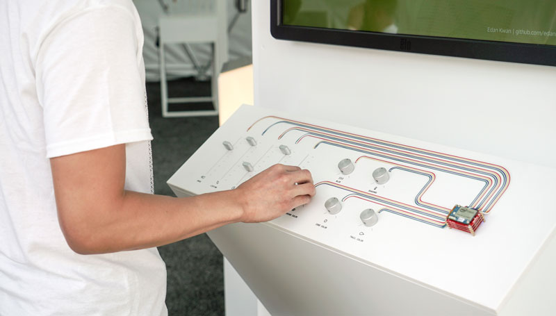
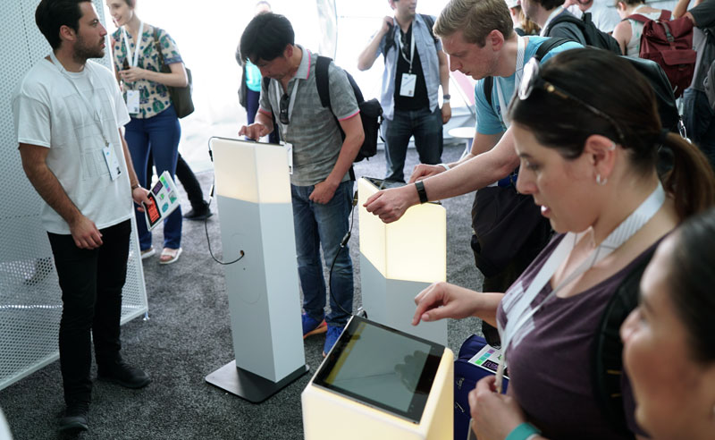

Things &amp; Firebase
===

While building our Experiments Tent for Google I/O 2017, we realized that 
on-screen controls were <i>so</i> 2016. 

So we built a couple things. This repository contains the code that powers the knobs 
and sliders controlling The Spirit, as well as the LED lights in the podiums for our
Quick, Draw! multiplayer experience.

The Spirit
---

The Spirit controls, located in [controller-app/](controller-app/), uses a newly 
created driver for Android Things, the [ADCV2x analog controller](). It reads
data from the sliders and dials and updates a
[Firebase Realtime Database](https://firebase.google.com/docs/database/). 
  
To make it even easier for developers, we created a simple library named 
[dat.fire](https://github.com/googlecreativelab/dat.fire), which connects 
[dat.gui](https://github.com/dataarts/dat.gui) controllers to any Firebase database 
in just a few lines of code. 

Check out [controller-app/](controller-app/) for a more detailed look, and look at this fork
of The Spirit, [here](https://github.com/trippedout/The-Spirit/blob/master/src/index.js#L55) 
and [here](https://github.com/trippedout/The-Spirit/blob/master/src/index.js#L185-L191), 
where we implemented [dat.fire](https://github.com/googlecreativelab/dat.fire).

Quick, Draw! Multiplayer
---

The contestant podiums for Quick, Draw! function in the opposite direction.
 
Rather than send data out, they listen for Firebase Realtime Database value change
events, and update their state accordingly. This was especially easy to implement
since Quick, Draw! was <i>already</i> using Firebase. 

They were way ahead of their time. #trendsetters

Check out the implementation details in [quickdraw-podiums/](quickdraw-podiums/)