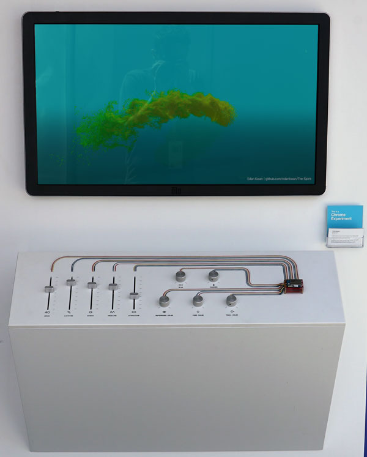
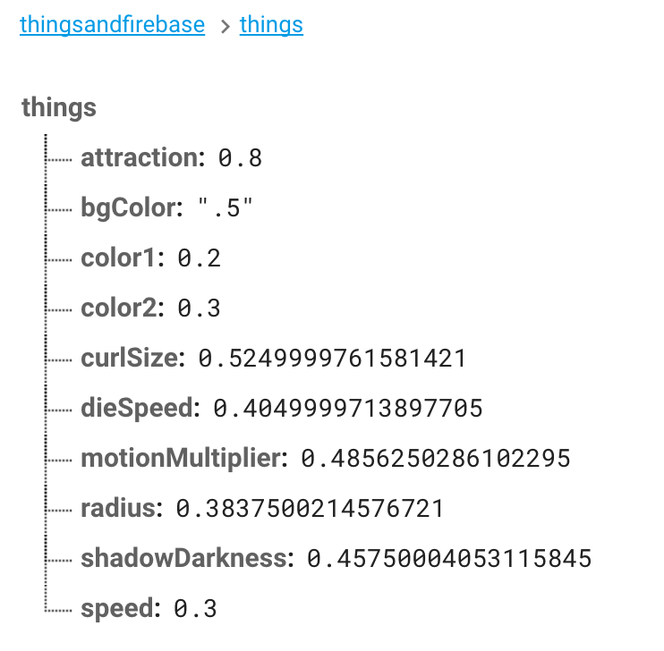

The Spirit - Things &amp; Firebase
===

The Spirit installation at Google I/O was given hardware controls powered by Android Things.

 

Each of the sliders and dials are pushed into our Intel Edison board running Android Things 
via 3 analog digital converters [available on Sparkfun](https://www.sparkfun.com/products/13770).

We were able to interface these blocks via a newly created driver: [Adcv2x, now part of
the contrib library for Things](https://github.com/androidthings/contrib-drivers/tree/master/adcv2x).

Android Things Analog to Digital Converter
----

For every ADC board you want to use, you need to first 
[instantiate an Adcv2x](src/main/java/com/androidexperiments/thingscontroller/MainActivity.java#L96):
```java
final Adcv2x upperAdc = new Adcv2x(Adcv2x.DEFAULT_BUS, Adcv2x.I2C_ADDRESS_48);
```

Every ADC board from Sparkfun has 4 available solderable addresses, available as static 
constants, meaning that Android Things can have up to 16 analog devices interfaced at once.

Once you have a ref to each Adcv2x, 
[we implemented](src/main/java/com/androidexperiments/thingscontroller/MainActivity.java#L99-L102) 
a simple wrapper class to make reading from specific channels and their associated name, 
and getting the normalized value back easier.

```java
mAnalogDevices.add(new AdcWrapper(upperAdc, 3, "curlSize"));
mAnalogDevices.add(new AdcWrapper(upperAdc, 2, "radius"));
mAnalogDevices.add(new AdcWrapper(upperAdc, 1, "dieSpeed"));
mAnalogDevices.add(new AdcWrapper(upperAdc, 0, "speed"));
```

Then we just read the voltage of each input in a loop via a Handler, and determine if the change
was large enough to warrant updating our Firebase Realtime Database, so we don't spam it.

The names associated with each AdcWrapper correspond exactly to our values in the Firebase 
Realtime Database:



